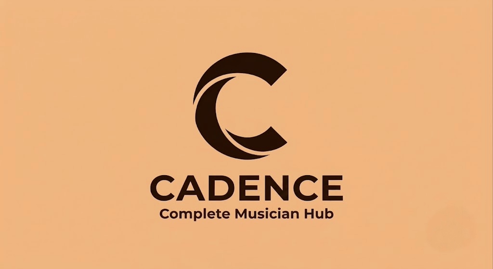

<p align="center">
  <picture>
    <source media="(prefers-color-scheme: dark)" srcset="assets/images/logo_dark_full.png">
    <source media="(prefers-color-scheme: light)" srcset="assets/images/logo_light_full.png">
    
  </picture>
</p>

<p align="center"><i>A native-timed, all-in-one practice engine for musicians — built with Flutter.</i></p>

<p align="center">
  
  
  
</p>

Cadence is an all-in-one practice assistant for musicians, built with Flutter. It replaces a folder of disconnected tools — a metronome app, a tuner app, a practice log, a binder of sheet music — with one offline-first workspace built around a single native-timed metronome engine.

## Why Cadence

Most practice tools solve one problem in isolation. Cadence ties them together: a metronome section roadmap can drive page turns in your sheet music, a tuner and tempo detector share the same microphone pipeline, and every practice session feeds the same stats and streak system. Everything runs locally — no account, no cloud dependency, no network required in a rehearsal room.

## Core Features

**Metronome engine**
- Sub-millisecond timing via a dedicated native thread (Kotlin `AudioTrack` pool on Android, Win32 `waveOut` + `QueryPerformanceCounter` on Windows) — the UI thread only polls for display, so audio timing is immune to Dart GC pauses or frame jank
- Full time signature support, including compound and odd meters (5/8, 7/8, 11/8) with selectable beat groupings
- **Piece Builder**: multi-section roadmaps (measure ranges, each with its own tempo/signature) that the engine transitions through automatically during playback
- **Blind BPM Randomizer**: hides a random tempo within a configurable window around a locked base — trains tempo recognition by ear, hard-capped to a 1–300 BPM range with no override
- **Cognitive Break**: injects controlled micro-fluctuations and dropped beats into a background rehearsal pattern to build tempo resilience, timed against the same native clock as normal playback

**Tuner & Tempo Ear**
- Chromatic tuner using a YIN-based pitch detector (cents-accurate, note + octave display)
- Live tempo detection from ambient audio, including a mixed-meter solver that infers tempo from odd-grouping onset patterns (e.g. recognizing a 7/8 pulse instead of assuming even beats)
- Both run on a dedicated Dart isolate reading raw microphone PCM, with a software gain stage tuned for real-world (quiet, unprocessed) input levels

**Rehearsal Canvas**
- Attach sheet music images directly to an exercise; swipe through pages during a practice session
- Vector-based annotation layer (draw/erase directly on the page) that persists per exercise
- Optional auto page-turn: link a Piece Builder roadmap to a score so pages advance automatically as the metronome crosses measure boundaries

**Practice tracking**
- Exercise and category library with BPM history, goals, and progress
- Calendar view with practice reminders and streak tracking
- Local session history and stats — no data leaves the device

## Tech Stack

| Layer | Technology |
|---|---|
| UI framework | Flutter / Dart |
| State management | Riverpod |
| Persistence | Drift (SQLite), versioned schema migrations |
| Metronome audio | Native platform threads via `MethodChannel` (Kotlin on Android, C++ on Windows) — not a Dart `Timer` |
| Mic-based analysis | Dedicated Dart `Isolate` running pitch/tempo DSP off the UI thread |
| Sheet music storage | Local file storage with per-page vector annotation records |
| Targets | Android, Windows desktop (iOS/macOS/Linux buildable from the same codebase) |

## Project Structure

```
lib/
  core/            App-wide constants, theme, and design tokens
  data/
    database/       Drift schema, tables, and migrations
    repositories/    Data access layer between the database and the app
  domain/
    models/          Plain data models
    services/        Business logic — metronome engine, audio analysis (pitch/tempo)
    validators/      Input validation
  presentation/
    providers/       Riverpod providers wiring state to the UI
    screens/         One folder per feature (metronome, tuner, scores, calendar, stats, ...)
    widgets/         Shared, reusable UI components
```

Each feature screen owns its providers and widgets; shared logic (the metronome engine, DSP analyzers, database access) lives in `domain/` and `data/` so it isn't duplicated across screens.

## Getting Started

```bash
flutter pub get
flutter run
```

Requires the Flutter SDK (channel stable) and a connected device or emulator. Windows desktop builds require Visual Studio with the "Desktop development with C++" workload.
